# HTB UNI CTF 2020

## Hardware Challenge: Block

### Challenge Brief:

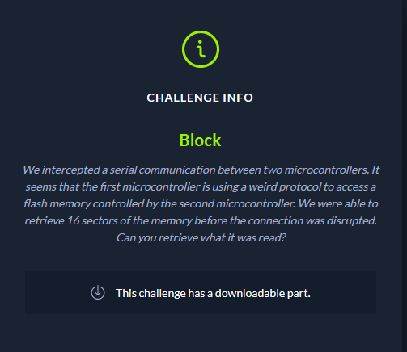

### Downloadables:

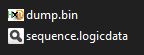

Opening the **.logicdata** file in [Salea Logicviewer](https://www.saleae.com/downloads/), we are presented with a single channel of data. Alone, this looks like nothing of interest. However, the brief states that serial communication had been intercepted. To try to find the protocol used, the ****Async Serial** analyser was chosen from the **Analyzers** menu on the right-hand side.

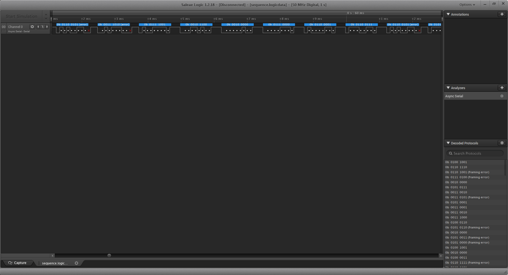

This clearly shows there to be some legible sort of data when using this protocol.

The framing errors were fixed by changing the parity bit from **No Parity Bit** to **Even Parity Bit** in the **Async Serial** settings.

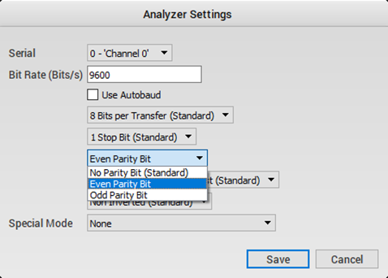

To check for readable characters; from the **Options** menu in the top-right, change the **Display Radix** to **ASCII**.

We are now presented with readable text, which notably begins with:
`Init"W25Q128FV" SPI"Comm..xy"sector:x,"page:y,"page_offset:xy`

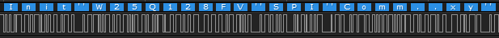

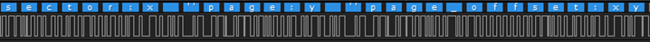

The above text is followed by pairs of integers separated by **\r** and **\n**. These are likely to be the values for **X** and **Y**.

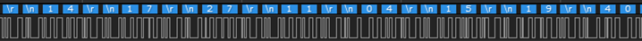

**W25Q128FV** appears to be a flash memory module made by Winbond, who provide a datasheet for the module, here: [https://www.winbond.com/resource-files/w25q128fv_revhh1_100913_website1.pdf](https://www.winbond.com/resource-files/w25q128fv_revhh1_100913_website1.pdf)

From the datasheet, we can determine the sector and page size of the memory module, to properly calculate the addresses of the data from the X and Y values:

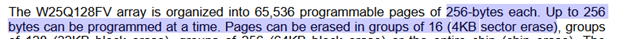

To determine the addresses of each sector and page file, a spreadsheet was used to note down the XY pairs and calculate the corresponding sector address and page address. These were then combined, along with the offset value to provide the byte address.

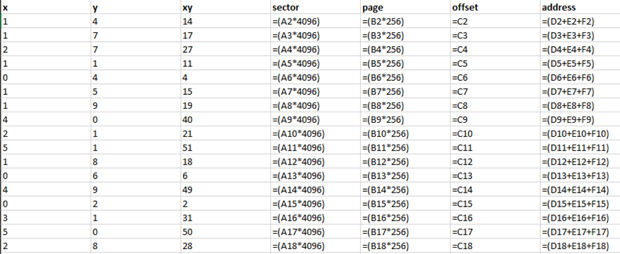

Now it’s just a matter of loading up the **dump.bin** file in a binary file viewer and picking out the bytes from the calculated offsets. **[HxD](https://mh-nexus.de/en/hxd/)** was used for this particular task.

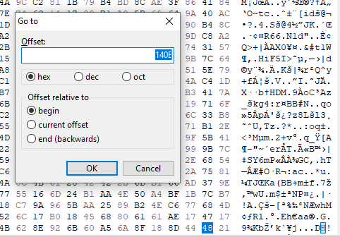

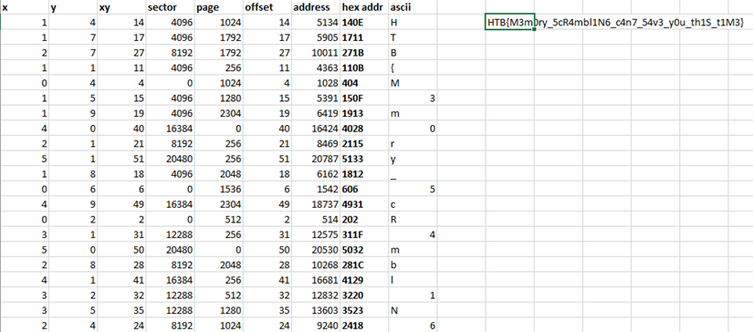

### flag:

HTB{M3m0ry_5cR4mbl1N6_c4n7_54v3_y0u_th1S_t1M3}