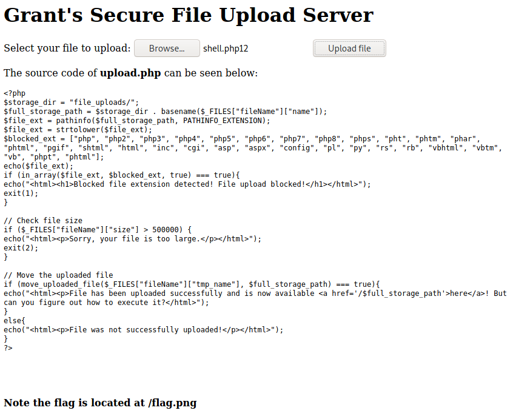
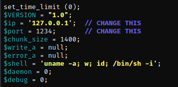
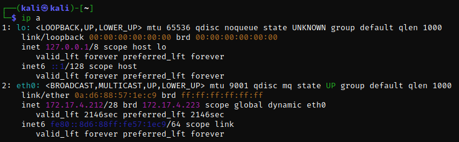
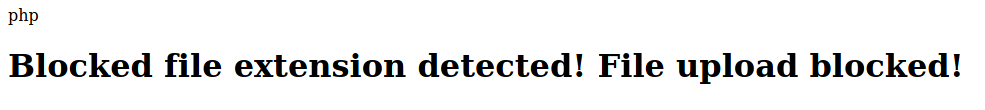
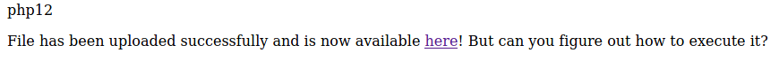
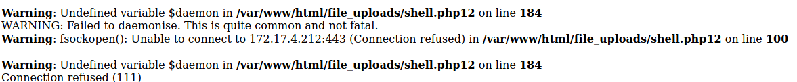
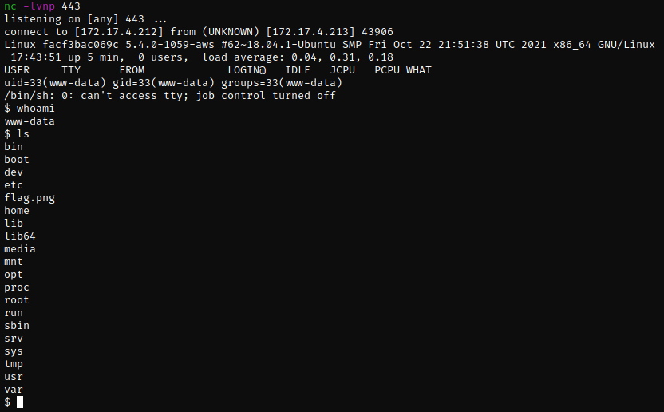

# 9 of Spades | Port 20055
Navigating to 127.0.0.1:20055, we are met with a page for "Grant's Secure File Upload Server".



As the page states that the flag is located at root, a shell will likely be needed to access the root folder and as the website uses php, a php reverse shell would be a safe bet.

`cp /usr/share/webshells/php/php-reverse-shell.php`



Change the $ip to the local IP address of the attacking machine, as the targets are on the same network.



Choose an available port. 443 was used as it is usually available for web shells.

Now we have created our shell, we need to find a way to upload it.

The source code for *upload.php* shows that many php file extensions have been blocked. We will need to use a different extension to bypass the block.





Changing the file extension from *php* to *php12* worked to bypass the block.

However, when attempting the access the file, we are now met with the source code being printed to the page rather than being executed by the server.

This will need to be included in the .htaccess file for the local folder.

Thankfully, this file upload allows for rewriting of existing files. We can just create a new .htaccess file with the necessary configuration to allow the execution of .php12 files!

`AddType application/x-httpd-php .php12`

When trying to access the reverse shell again we are now given the following errors:



This means the server has executed the shell but we need to set up the listener on the attacking machine.

`nc -lvnp 443`



The flag is visible in the `ls` output!

```bash
$ md5sum flag.png
270d4a0a9abc1c048102ff8b91f10927  flag.png
```