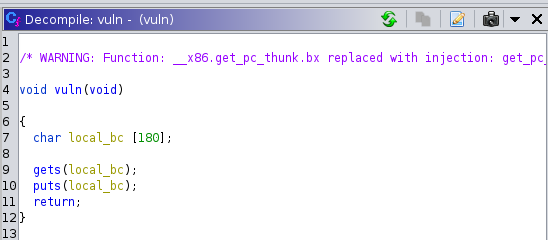

The 'You know 0xDiablos.zip' file contained a binary called vuln.
When executing the binary, a prompt is given in stdout sayting "You know who are 0xDiablos:" and waits for user input on a newline.
Any input given is then repeated back in stdout.

Opening the binary in ghidra

The vuln function assigns 180 bytes to the variable local_bc. It then takes and stores user input on the stack with gets(local_bc) and prints the input to stdout with puts(local_bc).

The vulnerability here is with the gets() function, which the man page for suggests to **never** use, as it continues to store data beyond the assigned buffer. This can result in a buffer overflow, affecting the rest of the data on the stack.

To test this out, we can fuzz the stack by adding a string of input with an identifyable pattern, so that when we debug the program in GDB, we can see which part of the pattern is present in specific registers.
This will enable us to then tailor the input to get the program to perform certain actions, by overwriting certain parts of the stack.

If we look at a visual representation of the stack layout, we can see that the local variables of a program are places on top, followed by the EBP, return address, and function arguments.

add a bunch of As

run it w/ gdb

fault at addr 0x41414141

find the addr of flag w/ `p32(exe.symbols["flag"],endian="little")`

put addr from exe.symbols in input at location of As that showed in return addr on stack in gdb

have a look in the flag function & see the parameters being compared

copy values of parameters into the input following the flag function address to put them in the argument places on le stack (but gotta pad off the flag address cause it gets popped off)

happy days done :D